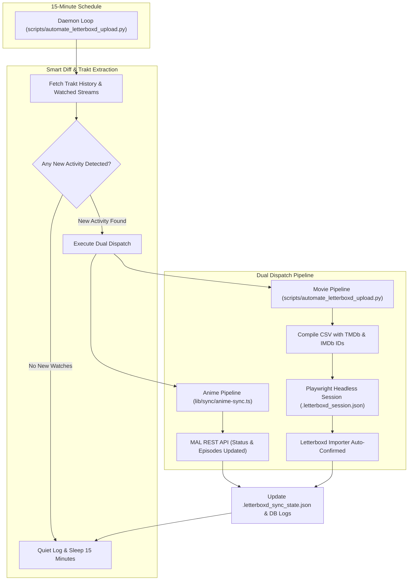

# Trakt Sync Engine — Core Functional Specification

This document defines the primary contract and operational behavior of the application. All ongoing developments, fixes, and performance verifications must be validated against this baseline specification.

---

## 🎯 The Core Specification

The application operates as an autonomous, unified synchronization engine with four primary pillars:

| Pillar | Requirement | Implementation Behavior |
| :--- | :--- | :--- |
| **1. 15-Minute Cadence** | Continuous background polling | The engine initiates a sync evaluation cycle every **15 minutes**. |
| **2. Zero-Interference Sleep** | Smart diffing & resource efficiency | If **no new activity** occurred on Trakt, the daemon stays 100% silent, consumes virtually no CPU, and **never** opens a browser window. |
| **3. Automated Anime Sync** | Trakt ➔ MyAnimeList (MAL) | Whenever anime is watched on Trakt, MAL is updated with new episode counts. Series are automatically set to **`completed`** upon watching the finale (even with non-sequential watches). |
| **4. Automated Movie Sync** | Trakt ➔ Letterboxd | Whenever a movie is watched on Trakt, real-time scrobbles are merged, a verified CSV is compiled, and Playwright imports and auto-confirms it into Letterboxd via saved session cookies. |

---

## 🏗️ Architecture & Component Mapping



---

## 🔍 Verification & Acceptance Criteria

When checking or auditing the application, verify against the following test cases:

### Pillar 1 & 2: 15-Minute Cycle & Smart Diffing
* **Daemon Execution**:
  ```bash
  npm run schedule:letterboxd -- --headless
  ```
* **Expected Output When Inactive**:
  ```text
  [2026-09-27 00:30:00] 🌸 Anime Sync: MAL is already up to date.
  [2026-09-27 00:30:00] 🔍 Checking Trakt movie watch history...
  [2026-09-27 00:30:01] ⏱️ Trakt is up to date (Latest: 'Mersal'). No new watches since last sync.
  💤 Sleeping for 15 minutes... Next check at 00:45:01.
  ```
* **No browser windows pop up, no CPU spikes**.

### Pillar 3: Trakt ➔ MyAnimeList
* **Real-time Episode Extraction**: Supports watches from both `/sync/watched/shows` and `/users/:username/history/shows`.
* **Out-of-Order & Series Finale Handling**:
  * If a user finishes Episode 12 of a 12-episode show (*like Death Parade*), even if an earlier episode was rewatched or missing, status must transition to `completed` and `num_watched_episodes` set to `12`.
* **Verification Route**: `POST /api/sync/trigger`

### Pillar 4: Trakt ➔ Letterboxd
* **Instant Scrobble Merging**: Movies watched within the last hour (*like Mersal*) must appear in the export CSV without waiting for Trakt's daily aggregation table.
* **Session Persistence**: Reuses `.letterboxd_session.json` to bypass sign-in and avoid Cloudflare Turnstile blocks.
* **Auto-Confirmation**: Submits matching automatically with `--auto-confirm`.

---

## 📁 Key File References

* [`GEMINI.md`](file:///e:/Projects/trakt-sync-engine/GEMINI.md): Persistent workspace rules and core specification contract.
* [`scripts/automate_letterboxd_upload.py`](file:///e:/Projects/trakt-sync-engine/scripts/automate_letterboxd_upload.py): 15-minute background loop, smart diffing, real-time Trakt merger, Playwright Letterboxd automation.
* [`lib/sync/anime-sync.ts`](file:///e:/Projects/trakt-sync-engine/lib/sync/anime-sync.ts): Anime identification, MAL mapping, and finale completion detection.
* [`lib/clients/trakt.ts`](file:///e:/Projects/trakt-sync-engine/lib/clients/trakt.ts): Dual-stream parallel fetcher (`/watched` + `/history`).
* [`.letterboxd_sync_state.json`](file:///e:/Projects/trakt-sync-engine/.letterboxd_sync_state.json): Tracks synced movie IDs and timestamps to prevent duplicate runs.
